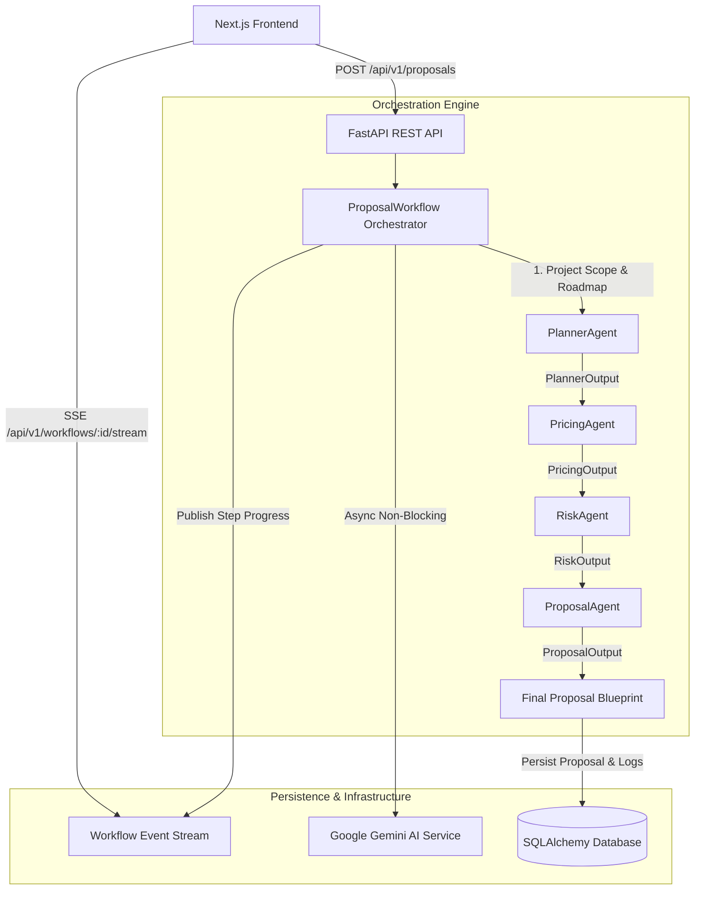

# 🚀 ScaleProposal AI — Production-Grade Multi-Agent Proposal Platform

> **AI-Powered Multi-Agent Business Proposal Generation Engine**

ScaleProposal AI is an enterprise-grade platform that automates the generation of comprehensive, client-ready business proposals using a **Hybrid Multi-Agent Architecture**.

Instead of relying on a single monolithic LLM prompt, ScaleProposal AI decomposes proposal generation into four specialized, autonomous AI agents—**PlannerAgent**, **PricingAgent**, **RiskAgent**, and **ProposalAgent**—working in sequence with structured Pydantic schema contracts, real-time Server-Sent Events (SSE) workflow streaming, and persistent database storage.

---

## ✨ System Features

- 🧠 **Genuine Multi-Agent Intelligence**: 4 specialized agents (`Planner`, `Pricing`, `Risk`, `Proposal`) with strict Pydantic output schemas.
- ⚡ **Asynchronous Non-Blocking Pipeline**: Built on FastAPI with non-blocking Gemini AI execution and exponential backoff retry policy.
- 📡 **Session-Isolated Real-Time Streaming**: Server-Sent Events (SSE) channels isolated per `workflow_id` to prevent cross-talk.
- 💾 **Robust Database Persistence**: SQLAlchemy ORM with SQLite/PostgreSQL support, Alembic migrations, and audit logs.
- 📄 **Professional PDF Export**: Client-side styled PDF generation from structured proposal blueprints.
- 🎨 **Modern Responsive Next.js UI**: Modern glassmorphism UI with progress timelines and interactive tabs.
- 🛡️ **Prompt Injection Defenses & Input Sanitization**: Defends untrusted inputs before submitting to LLM models.
- 🧪 **Comprehensive Test Suite**: Automated Pytest test suite with Mock AI providers and in-memory SQLite fixtures.

---

## 🏗️ Architecture Diagram



---

## 🧠 Multi-Agent Responsibilities

### 1️⃣ Planner Agent (`PlannerAgent`)
- **Inputs**: Company name, project type, requirements, optional budget/deadline/industry/audience.
- **Responsibilities**: Analyzes requirements, breaks down scope into deliverables, defines sequential roadmap phases, selects modern technology stack, estimates technical complexity, and maps system dependencies.
- **Output**: `PlannerOutput` (Pydantic model).

### 2️⃣ Pricing Agent (`PricingAgent`)
- **Inputs**: `PlannerOutput`.
- **Responsibilities**: Evaluates deliverable complexity, effort hours, team composition, development cost, cloud infrastructure cost, and annual maintenance cost. Combines LLM reasoning with deterministic total verification.
- **Output**: `PricingOutput` (Pydantic model).

### 3️⃣ Risk Agent (`RiskAgent`)
- **Inputs**: `PlannerOutput` & `PricingOutput`.
- **Responsibilities**: Assesses technical, security, integration, AI/model, timeline, budget, and operational risk vectors. Assigns severity, probability, impact, and concrete engineering mitigations.
- **Output**: `RiskOutput` (Pydantic model).

### 4️⃣ Proposal Agent (`ProposalAgent`)
- **Inputs**: `PlannerOutput`, `PricingOutput`, `RiskOutput`.
- **Responsibilities**: Synthesizes structured data from upstream agents into a complete executive business proposal without re-inventing numbers or stack selections.
- **Output**: `ProposalOutput` (Pydantic model + Markdown content).

---

## ⚙️ Quickstart & Setup Guide

### 1. Environment Requirements
- **Python**: 3.10+ (Tested on Python 3.12)
- **Node.js**: 18+ (Tested on Node 20+)

---

### 2. Backend Setup (FastAPI)

```bash
cd backend
```

Create virtual environment:

```bash
python -m venv venv
```

Activate virtual environment:

```bash
# Windows (PowerShell)
.\venv\Scripts\activate

# Linux / macOS
source venv/bin/activate
```

Install dependencies:

```bash
pip install -r requirements.txt
pip install pytest pytest-asyncio alembic
```

Configure Environment Variables (`backend/.env`):

```env
GEMINI_API_KEY=YOUR_GEMINI_API_KEY
GEMINI_MODEL=gemini-2.5-flash
DATABASE_URL=sqlite:///./scaleproposal.db
```

Run Database Migrations:

```bash
alembic upgrade head
```

Run FastAPI Backend Server:

```bash
uvicorn app.main:app --reload --port 8000
```

Backend will run at `http://localhost:8000` (Swagger docs available at `http://localhost:8000/docs`).

---

### 3. Frontend Setup (Next.js)

```bash
cd frontend
```

Install packages:

```bash
npm install
```

Configure Environment Variables (`frontend/.env.local`):

```env
NEXT_PUBLIC_API_URL=http://localhost:8000/api/v1
```

Run Next.js Dev Server:

```bash
npm run dev
```

Frontend will run at `http://localhost:3000`.

---

## 🧪 Testing

### Backend Unit & Integration Tests

Run the full pytest suite:

```bash
cd backend
.\venv\Scripts\python.exe -m pytest tests -v
```

All agent reasoning, workflow orchestrator steps, validation logic, and REST API database endpoints are covered by automated unit tests using mock AI providers and in-memory database fixtures.

### Frontend Build Verification

```bash
cd frontend
npm run build
```

---

## 📡 REST API Specifications

### `POST /api/v1/proposals`
Generate proposal, run multi-agent workflow, and persist result.

**Request Payload:**
```json
{
  "company_name": "ScaleOn",
  "project_type": "AI Platform",
  "requirements": "Build an automated multi-agent business proposal generator using Gemini AI.",
  "budget_target": "$15,000",
  "deadline_target": "6 Weeks"
}
```

### `GET /api/v1/workflows/{workflow_id}/stream`
Server-Sent Events (SSE) endpoint isolated per `workflow_id` for real-time progress updates.

### `GET /api/v1/proposals`
List proposal history with optional search filtering (`?search=Acme`).

### `GET /api/v1/proposals/{id}`
Fetch detailed proposal blueprint by ID or `workflow_id`.

### `DELETE /api/v1/proposals/{id}`
Delete proposal and associated execution step logs.

---

## 📄 License & Author

- **Author**: Akanshu Goel (AI & Software Systems Engineer)
- **License**: MIT License
