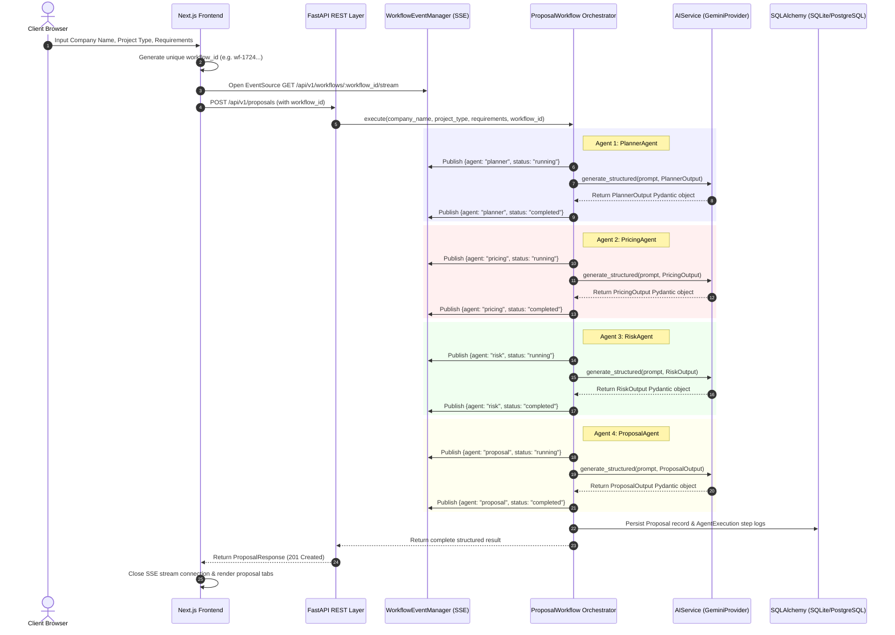

# 🏛️ ScaleProposal AI — System Architecture & Design Specification

This document details the production-grade software architecture, agent interaction models, event streaming design, and persistence schema for **ScaleProposal AI**.

---

## 1. High-Level Architecture Diagram

---

## 2. Component Design & Responsibilities

### 2.1 AI Provider Abstraction (`AIService` & `GeminiProvider`)
- **Location**: `backend/app/services/ai/`
- **Pattern**: Provider Pattern with Facade Singleton.
- **Design**: `AIProvider` defines `generate_text` and `generate_structured`. `GeminiProvider` implements lazy-loaded persistent `genai.Client` instances, non-blocking thread execution (`asyncio.to_thread`), automatic JSON schema enforcement, and exponential backoff retries (`AI_MAX_RETRIES = 3`).

### 2.2 Session-Isolated Event Manager (`WorkflowEventManager`)
- **Location**: `backend/app/services/event_manager.py`
- **Pattern**: Per-Session Publisher-Subscriber Queue.
- **Design**: Maintains an in-memory dictionary `_channels: Dict[str, asyncio.Queue]` indexed by `workflow_id`. Each request creates its own isolated queue, ensuring concurrent users receive only their own real-time execution events. Channels are automatically destroyed when streams terminate or client disconnects.

### 2.3 Persistence Layer (`SQLAlchemy` & `Alembic`)
- **Location**: `backend/app/database/`, `backend/app/models/`, `backend/app/repositories/`
- **Tables**:
  - `proposals`: Primary proposal storage (`id`, `workflow_id`, `company_name`, `project_type`, `requirements`, `estimated_total`, `pricing_range`, `timeline`, `overall_risk_level`, `planner_output`, `pricing_output`, `risk_output`, `proposal_output`, `final_markdown`).
  - `agent_executions`: Step audit log (`id`, `proposal_id`, `agent_name`, `status`, `execution_time`, `input_data`, `output_data`).

---

## 3. Security & Control Posture

1. **Prompt Injection Defense**:
   - `BaseAgent.sanitize_input()` removes control characters and dangerous null bytes from user-supplied inputs before assembling LLM prompts.
   - User inputs are explicitly demarcated inside structured system prompt containers.
2. **Cost Control & Input Validation**:
   - `ProposalCreateRequest` enforces string length constraints (e.g., `requirements` max length: 5000 chars, `company_name` max length: 100 chars).
   - Retry counters prevent infinite loops on malformed responses.
3. **Secret Protection**:
   - `GEMINI_API_KEY` is loaded strictly via `pydantic-settings` from environment files (`.env`).
   - Internal stack traces and provider keys are never exposed in user-facing HTTP error responses.
